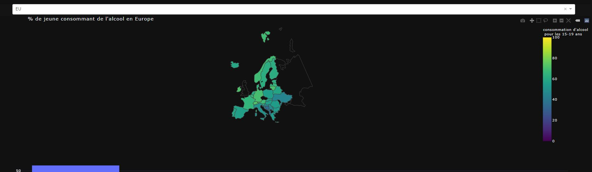

# Visualisation de la corrélation entre le nombre d'accidents de la route et de la consommation d'alcool

## Table des matières

 - [Introduction](#Introduction)
 - [User's Guide](#users-Guide)
 - [Developer's Guide](#developers-Guide)
 - [Rapport d'analyse](#rapport-danalyse)
 - [Lien vers les datasets](#lien-vers-les-datasets)
 - [Instructions d'execution](#instructions-dexecution)

## Introduction

Tous les ans, de jeunes conducteurs sont victimes d'accidents de la route, ce dashboard cherchera à savoir  si la consommation d'alcool des jeunes influe sur ce nombre d'accidents.

## User's Guide

Afin d'exécuter sans erreur ce code, il faudra installer tous les packages suivant dans votre invite de commande en tapant ceci : pip install le_nom_du_package.

Liste des librairies/packages utilisés :
- dash
- dash_bootstrap_components
- pandas
- dash_html_components
- dash_core_components
- dash.dependencies
- plotly.express
- base64
- datetime
- io
- dash_table

Il vous ait aussi possible d'installer tous ces packages directement via le requirements.txt en tapant la commande : **$ pip install -r requirements.txt**

Une fois les packages installés vous devez lancer l'application avec la commande : **py main.py**

## Developer's Guide

Ce guide mentionnera l'architecture et les fonctions utiles du projet ainsi que de potentielles pistes de développement.

#### L'architecture du projet

Le projet se décompose en 4 sous-dossiers qui sont Rapport, apps, data, pycache. 
A la racine du projet, il y a 5 fichiers :
- app.py (initialise l'application et crée le serveur Dash)
- data.py (Ce fichier met en forme et traite la data afin de la rendre exploitable)
- main.py (Ce fichier génère le layout en fonction de l'url, il initialise aussi l'application sur l'adresse  localhost:5000/)
- requirements.txt (Liste de toutes les librairies nécessaire au lancements de l'application)
- README.md

Le dossier **apps** se compose d'un dossier pycache et de 6 fichiers :
- **__init__.py** (permet de définir le dossier comme packages)
- app1.py (contient la page 1 du dashboard)
- app2.py (contient la page 2 du dashboard)
- app3.py (contient la page 3 du dashboard)
- erreur.py (contient la page à afficher en cas de mauvais URL)
- nav.py (contient la barre de navigation présente sur toutes les pages)
Le dossier **data** est le dossier où se trouve les csv nécessaire à l'application. 
Le dossier **Rapport** comprend les captures d'écrans des différents graphes affichés. 

#### Les différentes fonctions présentent dans le projet

Dans le fichier **main.py** 
> La fonction display_page(pathname) prend en parametre une string et renvoie la bonne affichage en fonction de l'url

Dans le fichier **data.py** 
> La fonction recuperationDataAlcool(type) prend en parametre une string et renvoie les informations voulues. 
Pour la string :  
> - "data" la fonction ouvre le csv et le retourne 
> - "total" la fonction renvoie le nom de la colonne du csv qui selectionne le pourcentage totale (hommes+femmes) du nombre de consommateur d'alcool ainsi que le nom à afficher 
> - "man" la fonction renvoie le nom de la colonne du csv qui selectionne le pourcentage d'hommes consommant de l'alcool ainsi que le nom à afficher 
> - "female" la fonction renvoie le nom de la colonne du csv qui selectionne le pourcentage de femmes consommant de l'alcool ainsi que le nom à afficher 
> - "moyenne" renvoie la moyenne par continent de consommateur d'alcool 
> - "continent" renvoie la liste des continents 

> La fonction recuperationDataAccident(type) prend en parametre une string et renvoie les informations voulues. 
> Pour la string :  
> - "data" la fonction ouvre le csv et le retourne 
> - "dataClear" la fonction nettoye les données en supprimant toutes les lignes inutiles et renvoie les données nécessaire 
> - "MapAccident" la fonction nettoye les données et renvoie les données nécessaire ainsi que le nom de la colonne à sélectionner 
> - "PaysSelect" la fonction retourne la liste des pays possibles 

> La fonction recuperationDataTolerance(type) prend en parametre une string et renvoie les informations voulues. 
> Pour la string :  
> - "data" la fonction ouvre le csv et le retourne 
> - "MapTolerance" la fonction retourne le nom de la colonne à selectionner pour la création d'une carte ainsi que le nom à afficher en français 

Dans le fichier **nav.py** 
> La fonction NavBar(active) renvoie une barre de navigation à afficher dans chaque page, elle prend en parametre une string correspondant au nom de la page actuelle permettant de changer la couleur du bouton correspondant à la page

Dans le fichier **app1.py** 
> La fonction choropletGraph(scope,data,color,colorFrench,legendColor) retourne une map, elle prend en paramètres le scope(localsiation), data(les données),colorFrench(nom francais),legendColor(Couleur d'affiche des données) 
> La fonction InterMenu(pays_selected) retourne le nom du pays sous la bonne forme pour l'affiche de graphe ou map ainsi que le nom français, elle prend en parametre une string. 
> les fonctions upgrade_map(continent_select) permettent de mettre à jour les cartes en fonction des interactions avec les différents menu déroulant.la carte affiche les continents en fonction des continents choisis dans le menu déroulant. 

Dans le fichier **app2.py** 
> La fonction choropletGraph(scope,data,color,colorFrench,legendColor) retourne une map, elle prend en paramètres le scope(localsiation), data(les données),colorFrench(nom francais),legendColor(Couleur d'affiche des données) 
> les fonctions update_graph(scope) permettent de mettre à jour les cartes en fonction des interactions avec les différents menu déroulant.la carte affiche les continents en fonction des continents choisis dans le menu déroulant. 
> La première fonction update_graph(xaxis_column_name) permet de mettre à jour l'histogramme en fonction du pays choisi 

Dans le fichier **app3.py** 
> La fonction parse_contents(filename) permet de renvoyer un cvs sous forme de tableau dans un une page Dash, elle prend en parametre le nom du csv.  
> La fonction updtae_output(names) permet de mettre à jour le nom du csv en fonction du nom choisi dans le menu déroulant 

#### Pistes de développement

Il serait intéressant de trouver et d'afficher les différentes données dans les mêmes périodes de temps (entre 2000 et 2016), afin de mieux remarquer une possible corrélation. 
Les différentes carte affichées pourrait être faites à l'aide folium pour un rendu plus qualitatif. 
Une autre disposition des pages pourraient amener un éclaircissement de la pensée, cependant celui que nous avons choisi nous semblait le plus pertinent pour avoir l'ensemble des données par catégorie sur la même page.

## Rapport d'analyse

En réalisant ce dashboard nous avons chercher à mettre en valeur une potentielle corrélation entre la consommation d'alcool et le nombre d'accident de la route chez les jeunes. 
Pour ce faire, nous avons regroupé 3 datasets différents, un sur le nombre d'accidents de la route, un autre sur la tolérance d'alcoolémie au volant pour les jeunes conducteurs et un dernier sur le taux de consommateurs d'alcool dans les différents pays.

Les résultats obtenus montrent une nette diminution du nombre d'accidents de la route chez les jeunes. 
C'est en **Europe** et en **Amérique du Sud** que les jeunes consomment le plus d'alcool (53% des jeunes en consomment en Europe, et 36% en Amérique du Sud). 
Nous pouvons voir ces tendances sur le diagramme bar suivant :  

&nbsp;

&nbsp;

Pour avoir un aperçu plus précis de la consommation d'alcool dans les différents pays nous avons choisi d'afficher les cartes en fonction d'un continent choisi dans un menu déroulant. 
&nbsp;

&nbsp;

&nbsp;

Cela nous permet de regarder plus en détails la répartiton des consommateurs d'alcool. Nous avons aussi différencié la consommation chez les femmes et chez les hommes.

En Europe, la limite légale de concentration d'alcool dans le sang pour les jeunes conducteurs est d'environ **0.03g** (en moyenne).
&nbsp;

&nbsp;

Nous avons décidé d'afficher l'évolution du nombre de mort par pays et par année entre 2000 et 2016, cependant par manque de données sur la cosommation d'alcool nous ne pourrons pas conclure sur une corrélation dans le temps.
Néanmoins, le nombre maximal d'accidents par pays passe de plus de **8000** à moins de **3500** entre ces années, ce qui montre une baisse significative.

Cette tendance peut se constater en Europe, mais aussi dans la quasi-totalité des pays du monde que nous avons pu étudier.

Aux Etats-Unis cependant, nous observons que le nombre d'accidents reste stable chez les jeunes. En effet, les jeunes américains peuvent conduire en moyenne dès l'âge de 16 ans.
Ne pouvant consommer légalement de l'alcool avant l'age de 21 ans, ce n'est pas un facteur qui impacte significativement le nombre d'accidents de la route.

Ainsi nous remarquons, d'après les différentes lois sur le taux d'alcoolémie autorisé au volant et le nombre de morts par pays, que le durcissement de la législation n'influe pas grandement sur le nombre total d'accidents de la route. Par exemple, le nombre de morts en France et en Allemagne est semblable alors que le taux d'alcoolémie autorisé dans le sang est différent. 
Nous pouvons aussi constater que le taux de personnes consommant de l'alcool n'influe pas sur le  nombre de morts par accident de la route, en effet si nous prenons le cas de la France et de la Suède, qui ont tous deux des taux semblable de consommateurs d'alcool, nous voyons clairement que le nombre de morts est différents.

Nous pouvons donc nous avancer à dire qu'il n'existe pas de corrélation factuelle entre le nombre de consommateurs d'alcool et le nombre de morts par accidents de la route dans un pays.

## Lien vers les datasets

Base de données "youth" : https://apps.who.int/gho/data/node.main.A1206?lang=en 
Base de données "tolerance" : https://apps.who.int/gho/data/node.main.A1209?lang=en 
Base de données "jeune_morts_cont" : https://stats.oecd.org/Index.aspx?DataSetCode=IRTAD_CASUAL_BY_AGE#  
Le préprocessing des bases de données est dans le dossier nettoyage_bdd.

## Instructions d'execution

- Télécharger le dossier "ProjetV1-master"
- Le dézipper
- Ouvrir l'invite de commande
- Se déplacer dans les répertoires afin que le répertoire courant soit ProjetV1-master
- installer les librairies requises (mentionnée dans le User's Guide)
- Rentrer cette ligne de commande dans l'invité : python main.py
